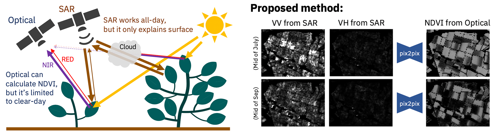

# SAR2NDVI: Pre-training for SAR-to-NDVI Image Translation (ICASSP 2024)



## Abstract

Geospatial machine learning is of growing importance in various global remote-sensing applications, particularly in the realm of vegetation monitoring. However, acquiring accurate ground truth data for geospatial tasks remains a significant challenge, often entailing considerable time and effort. Foundation models, emphasizing pre-training on large-scale data and fine-tuning, show promise but face limitations when applied to geospatial data due to domain differences. Our paper introduces a novel image translation method, combining geospatial-specific pre-training with training and test-time data augmentation. In a case study involving the translation of normalized difference vegetation index (NDVI) values from synthetic aperture radar (SAR) images of cabbage farms, our approach outperformed competitors by 31% in a public competition. It also exceeded the average of the top five teams by 44%.

Paper: https://ieeexplore.ieee.org/document/10448409

## Setup

- Tested environment
  - `Linux 20.04.5 LTS`
  - `Mac OS 13.2.1`

```bash
git clone git@github.com:IBM/SAR2NDVI.git
cd SAR2NDVI/

# Download dataset.zip
pip install awscli
aws --endpoint-url https://s3.jp-tok.cloud-object-storage.appdomain.cloud/ s3 cp s3://sar2ndvi/dataset.zip ./ --no-sign-request

# Put dataset folder at parent folder
# |- dataset/
# |- dataset.zip
# |- evaluation.py
# |- preprocessing.py
# |- ...
unzip dataset.zip

conda create -n ss_ndvi python==3.9
conda activate ss_ndvi

# for mac
conda install pytorch==1.12.1 torchvision==0.13.1 torchaudio==0.12.1 -c pytorch
# for linux (cuda 11.6)
conda install pytorch==1.12.1 torchvision==0.13.1 torchaudio==0.12.1 cudatoolkit=11.6 -c pytorch -c conda-forge

conda install -c conda-forge gdal==3.5.3
pip install -r requirements.txt
git clone https://github.com/junyanz/pytorch-CycleGAN-and-pix2pix.git

# for mac
brew cask install google-cloud-sdk
# for linux
curl https://sdk.cloud.google.com | bash

# Need an account for Google Earth Engine API and the authentication
# Please execute this function before running 1_preprocessing.py
python -c "import ee; ee.Authenticate();"
```

## Execute

### Scripts

```bash
# Preprocessing (took around 4 hours)
python preprocessing.py

# Training images (took around 3 hours with NVIDIA V100)
python training.py

# Evaluate a model (took around 1 minute with NVIDIA V100)
python evaluation.py
```

### Trouble shooting

- Error: `OMP: Error #15: Initializing libiomp5.dylib, but found libomp.dylib already initialized.`

  - Install nomkl

    ```bash
    conda install nomkl
    ```

- If you cannot execute preprocessing

  - You can download the preprocessed data

    ```bash
    pip install awscli
    aws --endpoint-url https://s3.jp-tok.cloud-object-storage.appdomain.cloud/ s3 cp s3://sar2ndvi/additional_data.zip ./ --no-sign-request
    unzip additional_data.zip
    ```

- If you cannot execute training

  - You can download the trained data

    ```bash
    pip install awscli
    aws --endpoint-url https://s3.jp-tok.cloud-object-storage.appdomain.cloud/ s3 cp s3://sar2ndvia/output.zip ./ --no-sign-request
    unzip output.zip
    ```

## Citation

```
@INPROCEEDINGS{10448409,
  author = {Kimura, Daiki and Ishikawa, Tatsuya and Mitsugi, Masanori and Kitakoshi, Yasunori and Tanaka, Takahiro and Simumba, Naomi and Tanaka, Kentaro and Wakabayashi, Hiroaki and Sampei, Masato and Tatsubori, Michiaki},
  booktitle={IEEE International Conference on Acoustics, Speech and Signal Processing (ICASSP)},
  title = {SAR2NDVI: Pre-Training for SAR-to-NDVI Image Translation},
  year = {2024},
  pages = {3865-3869},
  doi = {10.1109/ICASSP48485.2024.10448409}
}
```

## License

MIT License
